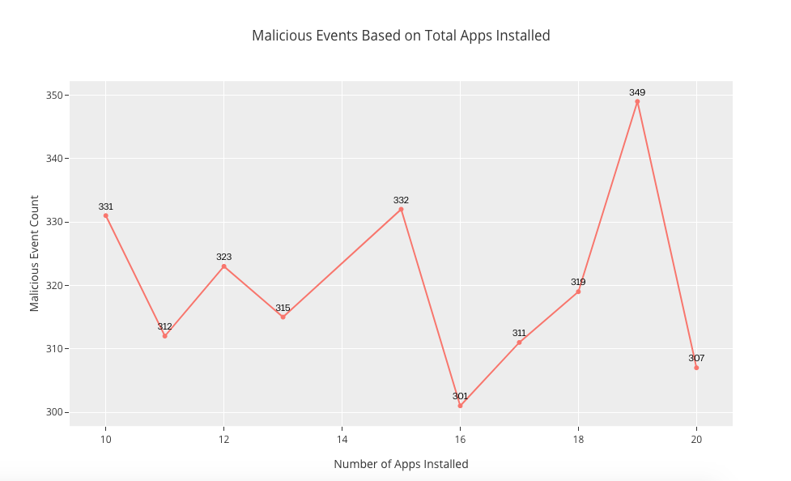
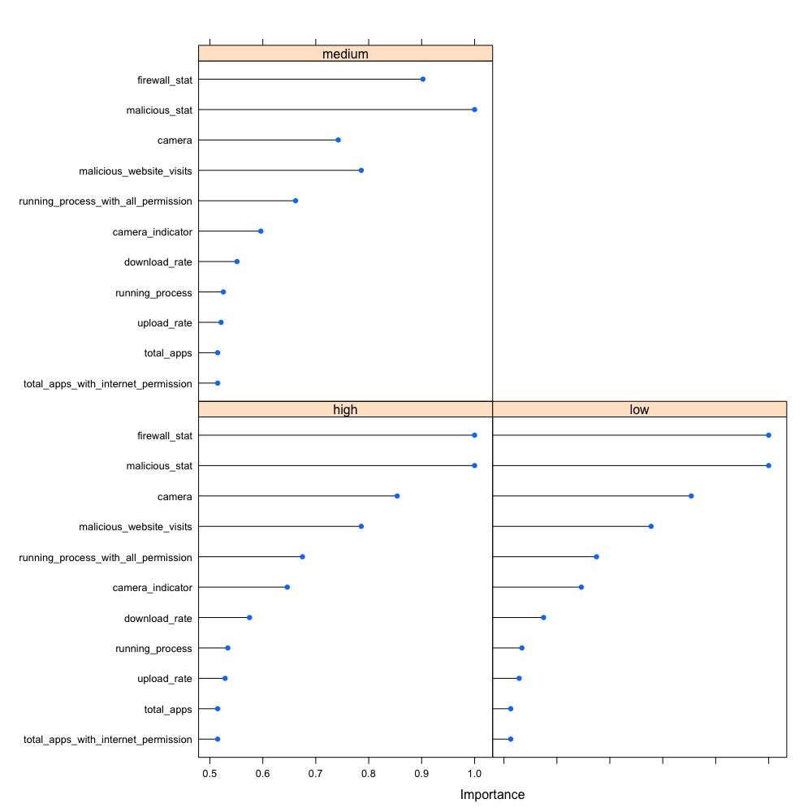
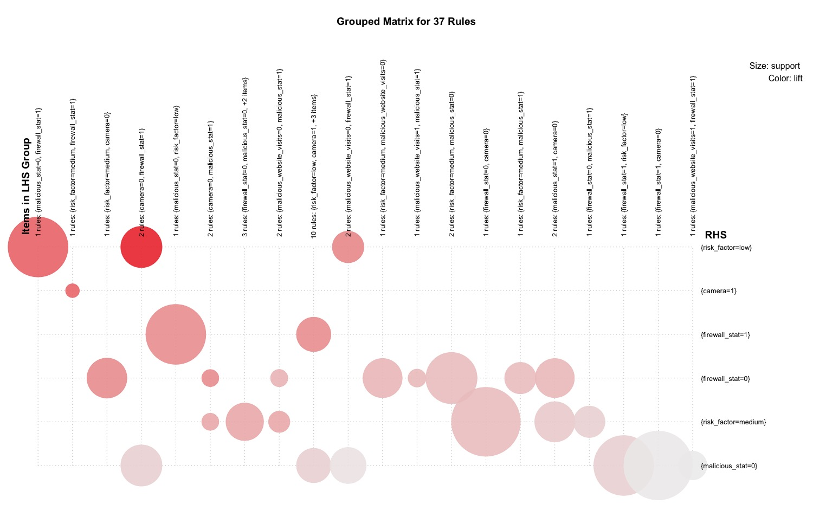

<style>
body {
text-align: justify}
</style>

```{r maincode, echo=FALSE}
library(ggplot2)
dataset <- read.csv('system_logs_dummy.csv')
```


###OVERVIEW/MOTIVATION

Today, with a drastic increase in technology and easy access to the Internet, the world is now much more connected than ever, open and accessible to Information on-line from anywhere and anytime. Almost any kind of information is now at our fingertips with just a click. With the highest advances in social networks and how people connect online, there is a major amount of information is now available about almost every person on the Internet.

With the higher advantages of any application there is always a risk or a threat of misuse of the application/technology. The Internet and our Personal Computer with a high amount of computational power sitting at home is not any different, with the increase in the applications of the Internet, social media, privacy and security of the user data can be at a considerable amount of risk, that can be compromised, misused, and can be framed to lose the originality.

Cyber Security is a field where necessary actions are taken to prevent, find vulnerabilities, diagnosing the system to make it secure, and protect user’s privacy, etc. from these risks/threats that are generated from the use of the Internet. The steps on the basis includes monitoring and diagnosing;
**Applications running on the system,**
**Web Activity (On-line, Social Media Interaction, User Information like Passwords and Personal Details),**
**Public/Private Internet Access**
**Malicious Events**
**Firewall, etc.**

Many tools and softwares are written regularly to prevent the unauthorised access to the user’s information, many of them consists of manual diagnostics and many are automatic scripts. But with the drastic pace of increase of the Internet applications, Cyber Security is and always be a field of continuous development and research.

###GOALS

The main goal is to apply Machine Learning algorithms on the dataset generated from user activities, system events, etc. to find relevant insights on how to secure and reduce the chances of facing malicious events that may compromise user’s private data.

To create an analysis that can show relevant information regarding the activities that leads to malicious events and particular measures from user’s end to prevent it.

By applying these algorithms and training the machine learning model with enough data, we can generate some rules which can help pin pointing the degree of vulnerability, i.e. which events has more degree of vulnerabilities. These insights can help the user to make steps that can almost prevent the system from future threats.

###RELATED WORK

https://blog.f-secure.com/artificial-intelligence-and-machine-learning-in-cyber-security/

###OBJECTIVE

Through this project, I sought to answer a question below:

How to create a method that can allow a user to detect the scale of vulnerability in the system and prevent it by just using simple set of event parameters like Camera, Firewall, Running Processes, Analysing the kind of websites they visit, Number of apps installed, etc.

###PROBLEMS

Every year more than 100,000 systems gets hacked, including Personal Computers, Smartphones, Intelligent Devices connected to the Internet. From large organisations, small group of people to a consumer at personal level is affected from these attacks ultimately losing their private information.

There are several software products and even hardware gadgets are been created to solve this issue and to protect user from these attacks. Softwares like antivirus, anti-theft, online security, etc. are some of the examples of these products.

Statistics shows that overall 24% personal computers are unprotected all over the world at current stage, and in a time where almost everything is relying upon the Internet, 24% is quite a large estimation that needs to be reduced.
Apart from using software products that are mentioned above a normal consumer is completely unaware of the methods to protect their privacy on their system.

###DATASET

The main objective was to generate a dataset for training and testing purposes which includes very simple set of parameters captured from a system. The dataset used in this experiment is generated from a script which mimics the system environment variables and assign values according to it.

It can also be considered as a system wide logs. As a set of 11 features and 1 target variable is been generated with consideration of 10 consecutive weeks of logs consisting of 1000 entries in one week, we will see which one of the features are actually relevant for the final outcome and which one isn’t after training and testing the results further.

###ANALYSIS & APPROACH

The main challenge was to form relationship between some of features so that a user can determine what combined action to take to prevent any malicious event from occurring, due to the discrete nature of most of the features of the dataset it became quite hard to form a dependency.

Performing some visualisations I came to know that some of the features possesses less relevance to the final prediction result of our task, the visualisations from the analysis are shown below.

The graph shown visualises the total number of apps installed on the system compared to the target variable risk factor has a very less affect on the particular outcome.

```{r total_apps_risk_factor, echo = FALSE, fig.align="center"}
plot <- ggplot(dataset, aes(factor(total_apps)))
plot + geom_bar(aes(fill = risk_factor), position = 'dodge') + ggtitle('Risk Factor based on Total Number of Apps') + xlab('Total Number of Apps Installed') + ylab('Count')
```

Similarly the number of malicious events occurring in all 10 weeks with different number of apps installed, shows a very little percentage of deviation.

```{r total_apps_mal_stat, echo = FALSE, out.width = '100%', fig.align="center"}

```

After having these results I came to a conclusion to implement a feature ranking algorithm that ultimately reflects a light upon feature relevancy to the prediction.

```{r fetaure_ranking, echo = FALSE, out.width = '100%', fig.align="center"}

```

As we can see only the top 4 features are contributing for a good prediction outcome. Some of the visualisations related to these features are shown below.

The firewall status gives a good assumption of the system risk as a much **medium** to a little **high** on when the value is **0** and a much **low** to a moderation of **medium** when the value is **1**.

```{r firewall_stat_risk_factor, echo = FALSE, fig.align="center"}
plot <- ggplot(dataset, aes(factor(firewall_stat)))
plot + geom_bar(aes(fill = risk_factor), position = 'dodge') + ggtitle('Risk Factor based on Firewall Status') + xlab('Firewall Status') + ylab('Count')
```

The malicious status gives an assumption of the system risk as a much **medium** to a little **high** on when the value is **1** and a drastic amount of **low** to a moderation of **medium** when the value is **0**.

```{r mal_stat_risk_factor, echo = FALSE, fig.align="center"}
plot <- ggplot(dataset, aes(factor(malicious_stat)))
plot + geom_bar(aes(fill = risk_factor), position = 'dodge') + ggtitle('Risk Factor based on Malicious Events') + xlab('Malicious Event Status') + ylab('Count')
```

Moving on to the visualisation between malicious web activity and the risk factor, as it seems that only when the value of malicious web activity is **1** a little **high** risk factor is been observed.

```{r mal_web_risk_factor, echo = FALSE, fig.align="center"}
plot <- ggplot(dataset, aes(factor(malicious_website_visits)))
plot + geom_bar(aes(fill = risk_factor), position = 'dodge') + ggtitle('Risk Factor based on Malicious Website Visits') + xlab('Malicious Website Visit Status') + ylab('Count')
```

All these analysis shows us many aspects of our data. It’s time now we look at one another important aspect of it. During all these analysis practices I noticed some patterns and dependencies between the features which directly lead us to the conclusion of our outcome.

As we only have some features those are relevant for getting our desired outcome, I observed that the possibility just doesn’t end here. So I performed association rule learning methods on the relevant features to get some more insights of how some of the features form dependency with each other to estimate the desired outcome of our classifier.

```{r association_plot, echo = FALSE, out.width = '100%', fig.align="center"}

```

Therefore after getting all the insights and benefits of the association rules, 37 rules came out to form an association to get a good prediction.

The main benefit of applying association rule to our dataset was to generate insights that can help a user to take control over a group of features at once, resulting in preventing a particular attack related to those features.

###ALGORITHMS THAT WERE USED

As already mentioned in the approach regarding the dataset relevancy, before using that I’ve tried couple of machine learning algorithms to implement the classifier to get pilot results. My first approach was using Neural Networks with 6 nodes and 6 hidden layers respectively. Using this algorithm at the beginning was quite typical as without pruning the irrelevant features, the outcome of this method was at 100% accuracy.

A classifier with an outstanding accuracy is always good, but getting a full scale 100% accuracy seems to be suspicious at some times. I’ve tried using other algorithms like Decision Trees, Random Forests to solve the issue that was arising but only to get the same result over and over again.

During these experimentation and analysis I’ve figured out that some of the features from the dataset were a direct cause of the final outcome, as when the classifier stumbled upon these feature patterns it’ll directly know which class the outcome belongs too, and that was the cause of the perfect model accuracy.

Removing these features which were irrelevant to the classifier for our prediction, the problem was solved and I was getting a decent 92.4% accuracy on my pilot testing of the model. Finally my decision was to stick to the Random Forests algorithm with 500 trees to complete the task.

I’ve also implemented K-Fold Cross Validation method to get a better view at the performance of the classifier, using 10 folds created from the dataset with training and testing, the maximum accuracy reached out to 94.1% and 92.6% on an average respectively.

###CONCLUSION

Finally after performing a thorough data analysis, supervised methods to determine results and association to find rules and dependency within the dataset, I’ve come to a conclusion as follows:

By using a simple set of parameters as system logs even with less amount data i.e between 5,000 to 10,000 entires and training it with a supervised method we can get decent results that can be applied to predict upcoming vulnerable events in the system if implemented in real time.

Through data analysis and association rule discovery we came to know that some features share a mutual dependency within them, i.e. if a user can control over a group of given feature set as a rule generated from the method, probability of facing a malicious event will be reduced.


